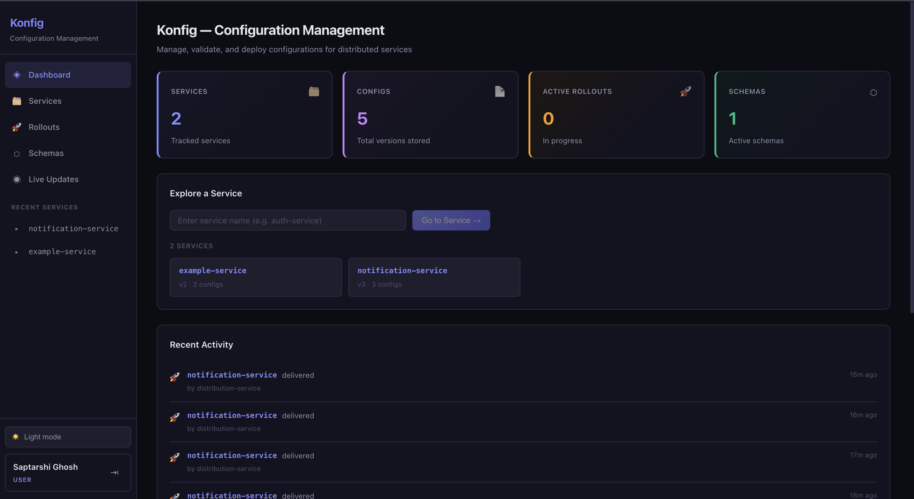
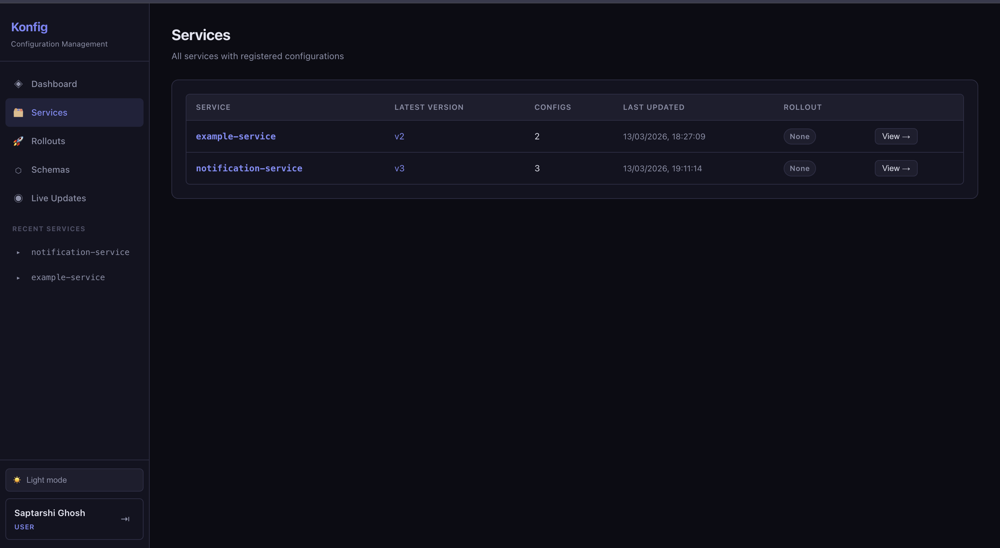
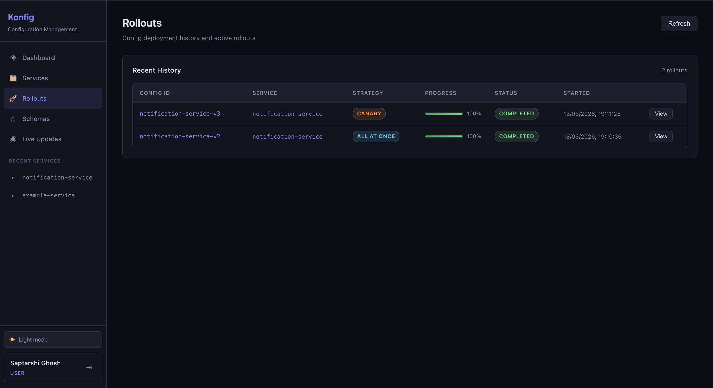

# Konfig Web Frontend

React dashboard for managing configs, rollouts, and schemas across distributed services.

## Screenshots

### Dashboard


### Services


### Rollouts


## Overview

- **Framework:** React 18 + TypeScript + Vite
- **State:** TanStack Query (server state) + React Context (auth)
- **Auth:** httpOnly cookie-based JWT — no tokens in JS; Google OAuth supported
- **Real-time:** WebSocket subscription per service for live config updates
- **Theme:** Dark/light mode toggle, persisted to `localStorage`

### Pages

| Page | Route | Description |
|------|-------|-------------|
| Dashboard | `/` | Stats tiles, service cards, recent activity feed |
| Services | `/services` | All services with config count and latest version |
| Service Detail | `/services/:name` | Config list, upload, delete, rollout, rollback |
| Rollouts | `/rollouts` | Deployment history with progress bars and status |
| Schemas | `/schemas` | Registered validation schemas |
| Live Updates | `/live` | Real-time WebSocket feed of config pushes |

## Project Structure

```
src/
  api/              # Axios client + typed API functions
    client.ts       # Axios instance (withCredentials: true)
    auth.ts         # login, signup, logout, me, googleLogin
    configs.ts      # CRUD for configs
    rollouts.ts     # Rollout start, promote, rollback, status
    schemas.ts      # Schema registration and listing
    stats.ts        # Dashboard stats and audit log
  components/       # Shared UI (Layout, ConfigList, RolloutPanel, etc.)
  contexts/
    AuthContext.tsx  # Session restoration from cookie on mount
  pages/            # Route-level pages
  index.css         # Global styles and CSS custom properties
public/
  konfig.svg        # App favicon
docs/
  screenshots/      # UI screenshots for README
```

## Running Locally

```bash
npm install
npm run dev
```

Runs on `http://localhost:5173`. Requires `konfig-web-backend` on port `8090` — API calls are proxied via Vite config.

## Build

```bash
npm run build
```

Output goes to `dist/`. Served in production by Nginx (see `Dockerfile`).

## Docker

```bash
cd ../Konfig
docker compose up --build -d web-frontend
```

The Nginx container serves the static build and proxies `/api` and `/ws` to the Go backend.

## Environment

No `.env` needed for the frontend — the API base URL is configured in Vite's proxy. Set `VITE_API_BASE` only if you need to override it:

```bash
# .env.local (optional)
VITE_API_BASE=http://localhost:8090
```
